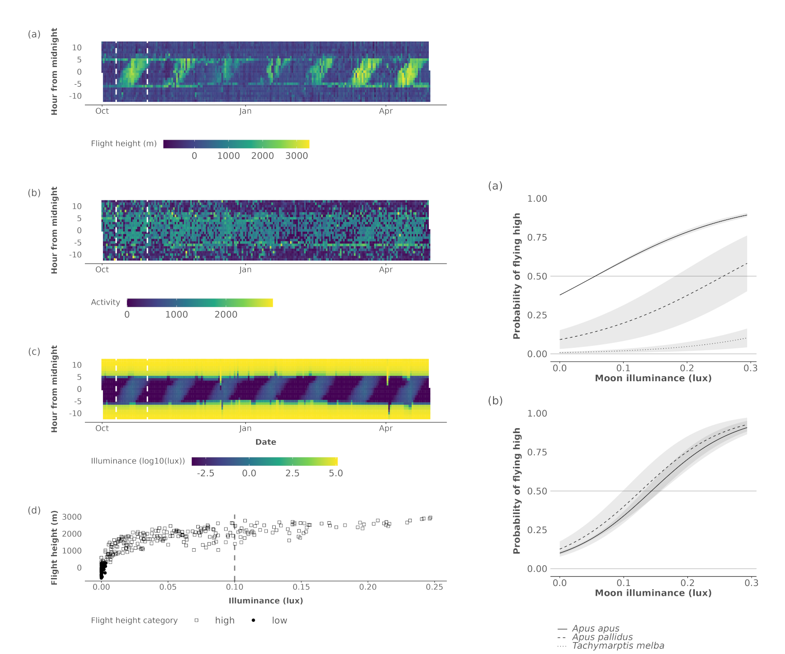

# Moonlight synchronous flights across three western palearctic swifts mirror size dependent prey preferences

Koen Hufkens, Christoph M. Meier, Ruben Evens, Josefa Arán Paredes, Hakan Karaardiç, Stef Vercauteren, Ann Van Gijsel, James W. Fox, Carlos Miguel Pacheco, Luis F. Pascoal da Silva, Sandra Fernandes, Pedro Henriques, Gonçalo Elias, Luís T. Costa, Martin Poot, Lyndon Kearsley

## Abstract

Recent studies have suggested the presence of moonlight mediated behaviour in avian aerial insectivores, such as swifts. At the same time swift species also show differences in prey (size) preferences. Here, we use the combined analysis of state-of-the-art data logger data across three swift species, the Common, Pallid and Alpine swifts, to quantify flight height and activity responses to crepuscular and nocturnal light conditions. Our results show a significant response in flight heights to moonlight illuminance for Common and Pallid swifts, while a moonlight driven response is absent in Alpine swifts. Swift flight responses followed the size dependent altitude gradient of their insect prey. We show a weak relationship between nighttime illuminance driven responses and twilight ascending behaviour, suggesting a decoupling of both crepuscular and nighttime behaviour. We suggest that swifts optimise their flight behaviour to adapt to favourable nighttime light conditions, driven by light responsive and size dependent vertical insect stratification and weather conditions.

## Data structure

Analysis data is saved as compressed R serial files (.rds) in the [`data` folder](https://github.com/bluegreen-labs/swift_lunar_synchrony/tree/main/data). Scripts to reproduce the main statistical results are provided in the [`analysis` folder](https://github.com/bluegreen-labs/swift_lunar_synchrony/tree/main/analysis). Data contain the below fields:

| Variable         | Description                                                                          |
|------------------|--------------------------------------------------------------------------------------|
| tag              | tag id of the data logger used (alpha/numeric)                                       |
| species          | swift species                                                                        |
| lag_altitude     | lagged altitude to account for correlations in the residuals of models               |
| moon_illuminance | moon illuminance (in lux)                                                            |
| moon_phase       | moon phase (descriptive)                                                             |
| stages           | stages of the day (day, dawn, dusk, night)                                           |
| altbin           | Altitude bin, if data is low or high (0, 1)                                          |

## Licensing

Be mindful of the CC-BY 4.0 license of the data and figures. Reuse is permitted on the condition of proper attribution and documentation of any changes.
