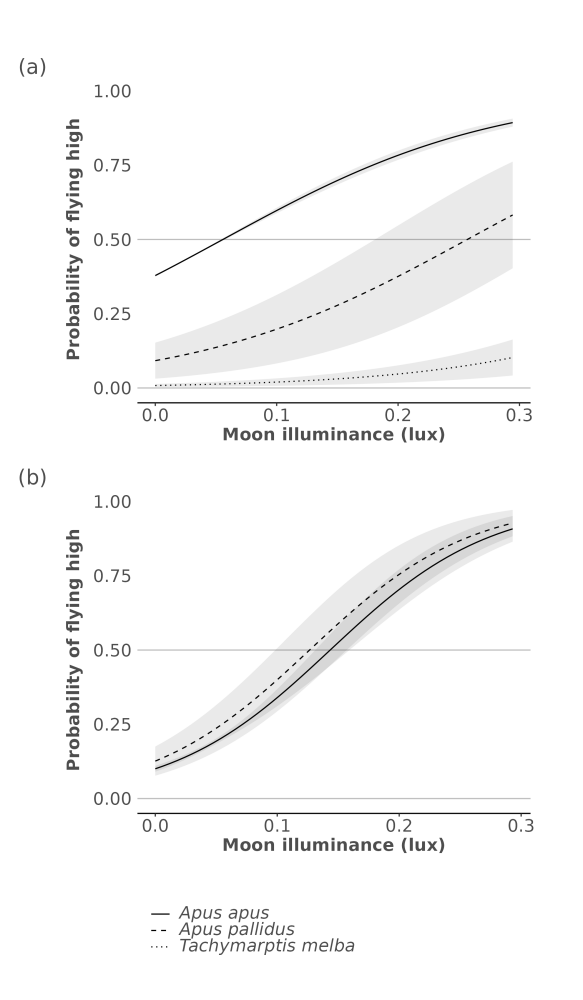

```{r include = FALSE}
library(lme4)
library(glmmTMB)
```

Brief overview of model analysis results, dynamically rendered as website output using the open data. The full files are presented in the [`analysis` folder](https://github.com/bluegreen-labs/swift_lunar_synchrony/tree/main/analysis).

## Moonlight flight height responses

### Multi-data logger results (Table 1)

```{r warning=FALSE, message=FALSE}
# read the data
df <- readRDS(here::here("data/curated/data_MDL.rds"))

# fit the model
fm_lagged <- glmmTMB::glmmTMB(
  altbin ~ moon_illuminance + lag_altitude + species + (1|species/tag),
  data = df,
  family = binomial
)

# report statistics of Table 1
print(summary(fm_lagged))
```

### GPS based results (Table 2)

```{r warning=FALSE, message=FALSE}
# read the data
df <- readRDS(here::here("data/curated/data_GPS.rds"))

# fit the model
fm <- glmmTMB::glmmTMB(
  altbin ~ moon_illuminance + species + (1|species/tag),
  data = df,
  family = binomial
)

# report the statistics of Table2
print(summary(fm))
```

The above model responses are well captured visually in Figure 4 of the main manuscript, as shown below.

```{r echo=FALSE, fig.cap="Figure 4. Marginal effect sizes by species for the generalised linear mixed effects logistic models relating moon luminance with flight height for both MDL, i.e. showing the probability of a high nighttime flight relative to daytime flight altitudes for MDL (a) and GPS (b). Grey 95% Confidence Intervals (CIs) were computed using a Wald z-distribution approximation and a standardised dataset.", out.width="50%", fig.align='center'}

```

## Twilight dynamics

### MDL based flight timing (Table 3)

```{r}
# read the data
df <- readRDS(here::here("data/curated/data_twilight.rds"))

fm <- lme4::lmer(
  twilight_timing ~ moon_illuminance + (1|species/tag),
  data = df
)

# return twilight statistics
print(summary(fm))
```
