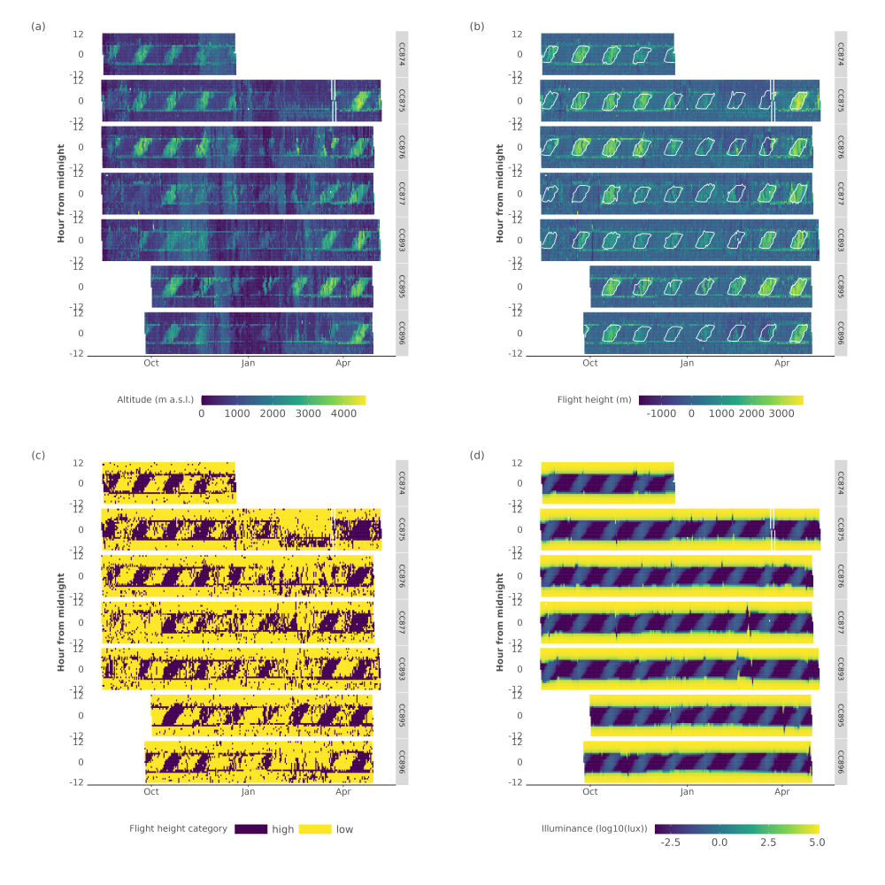
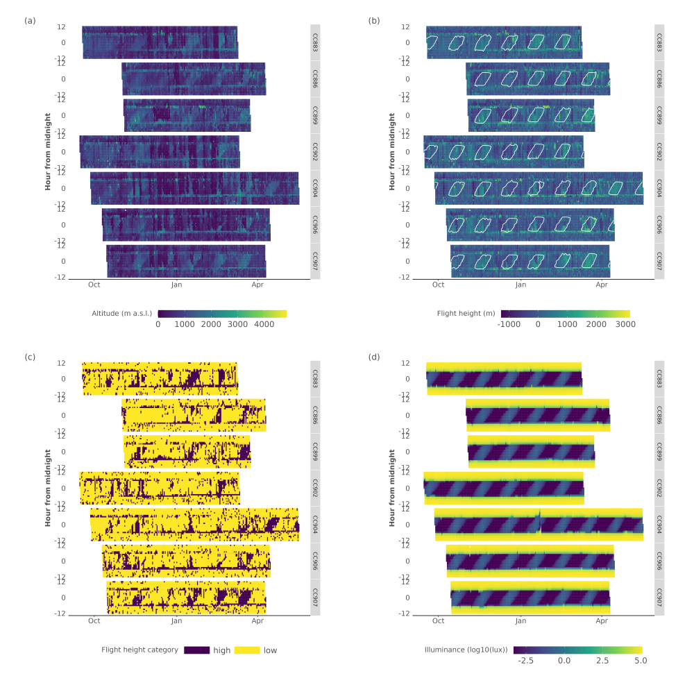
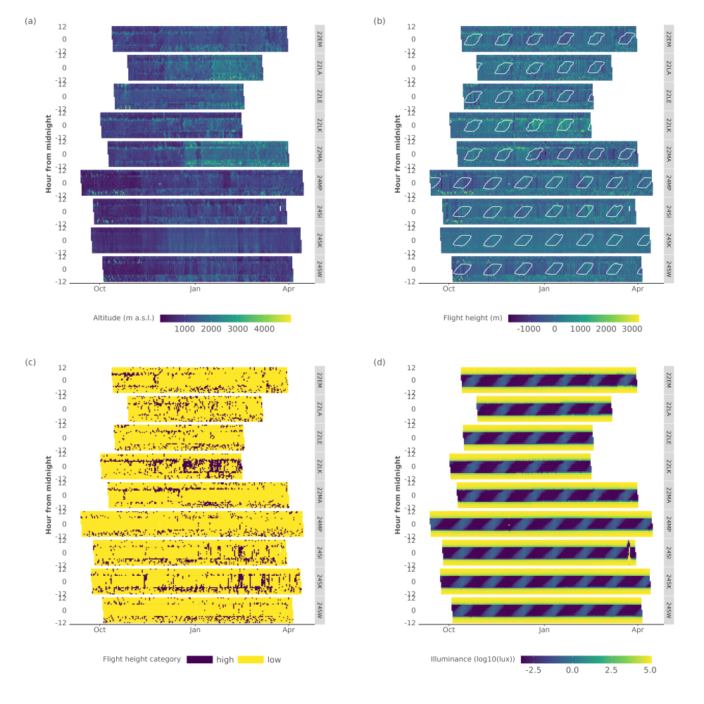
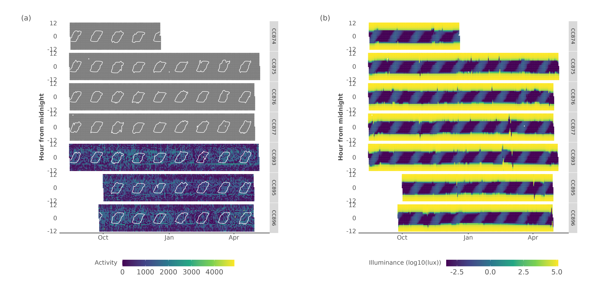
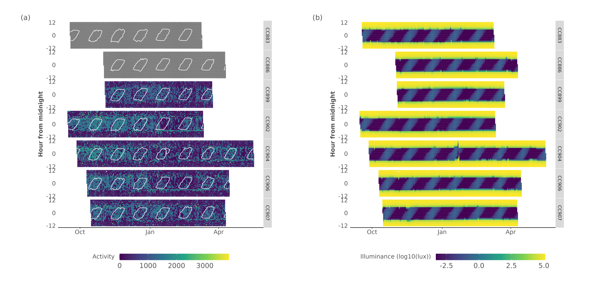
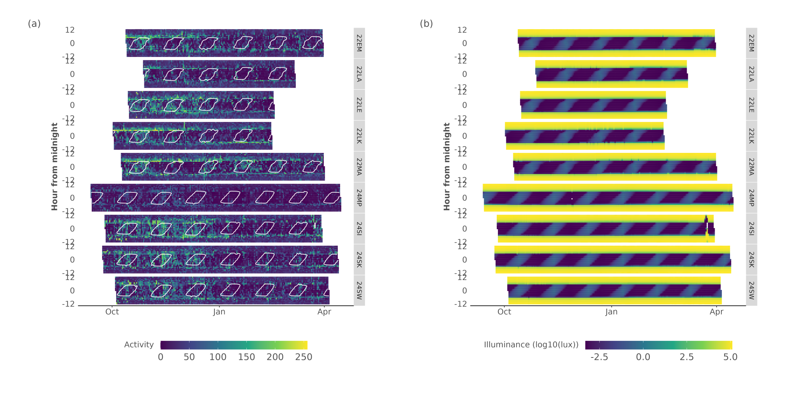
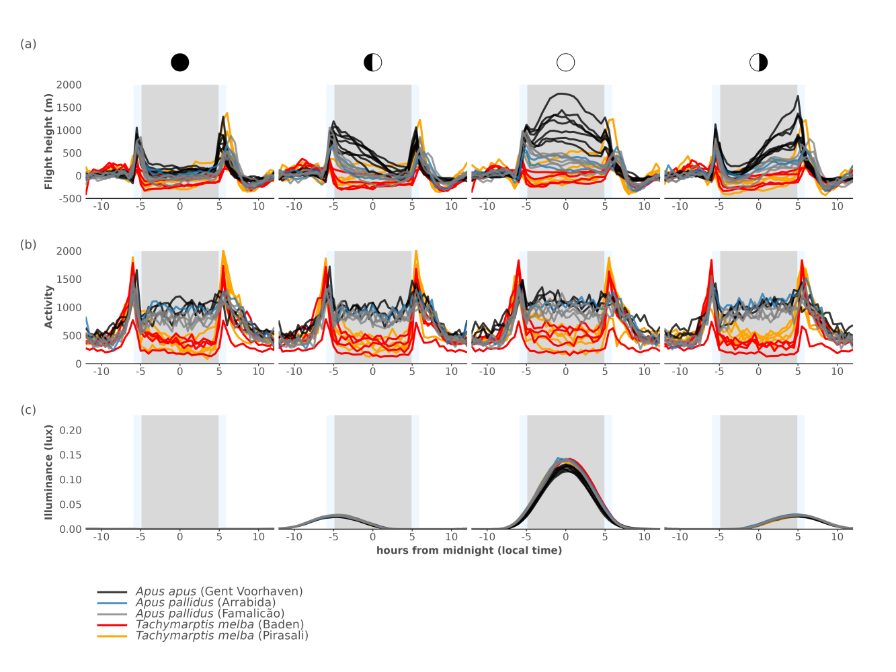
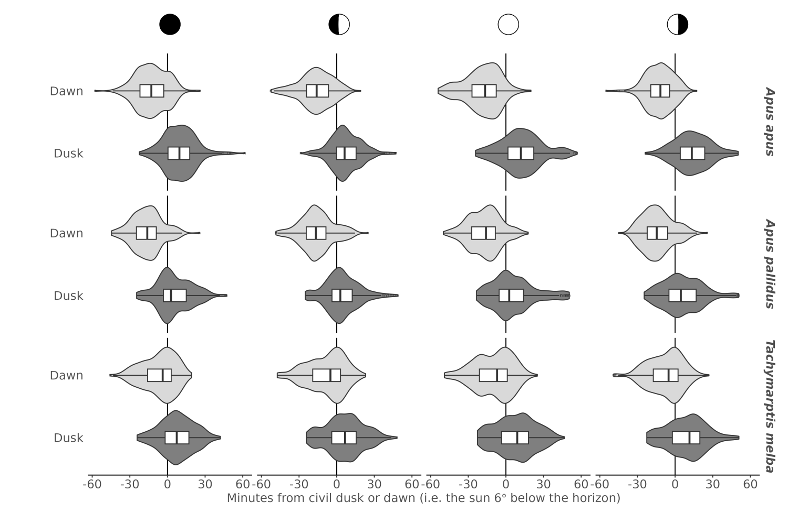
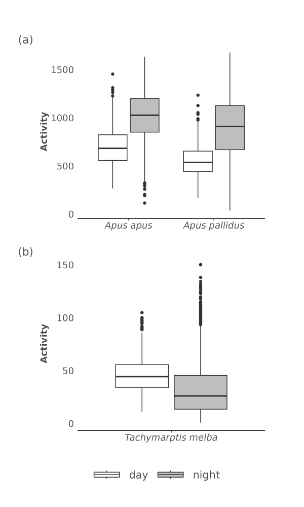

```{r setup, include = FALSE}
knitr::opts_chunk$set(
  collapse = TRUE,
  comment = "#>"
)
```

## Methods

Swift movements were categorised as migration (corridor movements) and stationary (area-restricted search) using a two-state Hidden Markov Model (McClintock & Michelot 2018, HMM), with missing positions filled using continuous-time correlated random walk data (Johnson et al. 2008) to create a homogeneous six-hour time series. Step distances (i.e. Euclidean distances between subsequent GPS positions) were modelled using a gamma distribution, while turning angle distributions followed a von Mises distribution (initial parameters; gamma distributions: μf = 50 km, σf = 10 km; μm = 80 km, σm = 10 km; von Mises distributions: μf = 0, κf = 1; μm = 0, κm = 2, migration and foraging denoted with subscripts m and f, respectively). State classes (i.e. migration, stationary) were returned using global encoding with the Viterbi algorithm (Zucchini et al. 2016, McClintock & Michelot 2018).
 
 Atmospheric pressure recorded was converted to altitude (z) using the international standard atmosphere which is defined as:

$$ z = \frac{T_0}{L}*\left({\frac{P_0}{P}}^{\frac{LR_0}{g}} - 1\right)$$

With T~0~ the temperature at sea level (288.15 K), L the temperature lapse rate (-0.0065° K m^-1^), P~0~ the standard atmospheric pressure at sea level (1013.25 hPa), P the measured air pressure (hPa), g the gravitational acceleration (9.81 m s-1) and R0 the universal gas constant (287.053 J kg^-1^ K^-1^). 

Additional summary statistics to those described in the main manuscript are provided. We report mean average flight altitude and height, activity with their uncertainty (on standard deviation). Furthermore we tabulate current and/or long term swift recapture rates.

## Figures

```{r echo=FALSE, fig.cap="Figure S1. Overview plots (actograms) of Apus apus Multi Data Logger (MDL) data for flight altitudes (a), normalised flight heights (b) and the derived binary flight height classes (c). In addition, we provide the (log10) total illuminance for a given day (d). Data is shown for all MDL tags, with time centred on local midnight. Moon illuminance values outlining all values larger than 0.01 are contoured in panel (b).", out.width="100%"}

```

```{r echo=FALSE, fig.cap="Figure S2. Overview plots (actograms) of Apus pallidus Multi Data Logger (MDL) data for flight altitudes (a), normalised flight heights (b) and the derived binary flight height classes (c). In addition, we provide the (log10) total illuminance for a given day (d). Data is shown for all MDL tags, with time centred on local midnight. Moon illuminance values outlining all values larger than 0.01 are contoured in panel (b).", out.width="100%"}

```

```{r echo=FALSE, fig.cap="Figure S3. Overview plots (actograms) of Tachymarptis melba Multi Data Logger (MDL) data for flight altitudes (a), normalised flight heights (b) and the derived binary flight height classes (c). In addition, we provide the (log10) total illuminance for a given day (d). Data is shown for all MDL tags, with time centred on local midnight. Moon illuminance values outlining all values larger than 0.01 are contoured in panel (b).", out.width="100%"}

```

```{r echo=FALSE, fig.cap="Figures S4. Overview plots (actograms) of Apus apus Multi Data Logger (MDL) data for flight activity (grey values are missing data) (a). In addition, we provide the (log10) total illuminance for a given day (b). Data is shown for all MDL tags, with time centred on local midnight. Moon illuminance values outlining all values larger than 0.01 are contoured in panel (a). Missing values are shown as grey.", out.width="100%"}

```

```{r echo=FALSE, fig.cap="Figure S5. Overview plots (actograms) of Apus pallidus Multi Data Logger (MDL) data for flight activity (grey values are missing data) (a). In addition, we provide the (log10) total illuminance for a given day (b). Data is shown for all MDL tags, with time centred on local midnight. Moon illuminance values outlining all values larger than 0.01 are contoured in panel (a).  Missing values are shown as grey.", out.width="100%"}

```

```{r echo=FALSE, fig.cap="Figure S6. Overview plots (actograms) of Apus pallidus Multi Data Logger (MDL) data for flight activity (grey values are missing data) (a). In addition, we provide the (log10) total illuminance for a given day (b). Data is shown for all MDL tags, with time centred on local midnight. Moon illuminance values outlining all values larger than 0.01 are contoured in panel (a).  Missing values are shown as grey.", out.width="100%"}

```

```{r echo=FALSE, fig.cap="Figure S8. Average flight height (flight height in m, centred on a daytime mean of 0), the flight activity and derived moon illuminance (lux) centred on midnight during moon phases (a - c). Different sites and species are indicated by the colour of the full lines, different lines represent different tags. The grey rectangle in plots (a - c) indicate the average astronomical night, where light blue rectangles approximate twilight as mean dusk and dawn ± 1 sd, respectively.", out.width="100%"}

```

```{r echo=FALSE, fig.cap="Figure S9. Box and violin plots of the distribution of the timing of maximum flight height during twilight, relative to civil dusk or dawn, by species and moon phase. The black vertical line at 0 indicates the timing of civil dusk or dawn. Values are expressed as minutes leading or lagging civil dusk or dawn events.", out.width="100%"}

```

```{r echo=FALSE, fig.cap="Figure S10. Box and violin plots of the distribution of daytime and nighttime flight activity by species.", out.width="50%", fig.align="center"}

```
